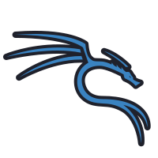
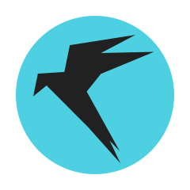

<h1 style="text-align: center;">About Me</h1>                                             
  

<strong>👨‍💻 Full-time cyber explorer | Aspiring exploit dev | Code + Chaos</strong>

 -----------------------------

 ## 🧪 Featured Projects

- 🛰️ **Androduct Framework** — Android post-exploitation toolkit (Smali patches, ADB control, CVE injection)
- 💀 **CodeRoaster** — An AI debugger that roasts bad code habits (sass mode + gamified)
- 🌐 **Mass Exploitation Scanner** — CMS fingerprinting + vuln exploitation (Inspired by `blckhrtz`)

----------------------------------------------

<h2>⚒️ My Skills Set</h2>

<table>
  <tr>
    <td><strong>☁️ Cloud</strong></td>
    <td></td>
  </tr>
  <tr>
    <td><strong>🌐 Networking</strong></td>
    <td></td>
  </tr>
  <tr>
    <td><strong>🛡️ Cybersecurity</strong></td>
    <td>
      
      
      
      
    </td>
  </tr>
  <tr>
    <td><strong>🎨 Design</strong></td>
    <td></td>
  </tr>
  <tr>
    <td><strong>💻 OS</strong></td>
    <td>
      
      
      
    </td>
  </tr>
  <tr>
    <td><strong>👨‍💻 Dev</strong></td>
    <td>
      
    </td>
  </tr>
</table>

                  

-----------------------------
 
## 🌐 Connect With Me

                 

                                        

                

I'd love to connect on social media. Let's chat about Artificial intelligence, Software development, cyber security, and blockchain technology! 💬

-------------------------

# 💪Collaboration

> I'm always open to collaborations and knowledge sharing. Feel free to connect with me and let's make the digital world safer! 🚀

  
